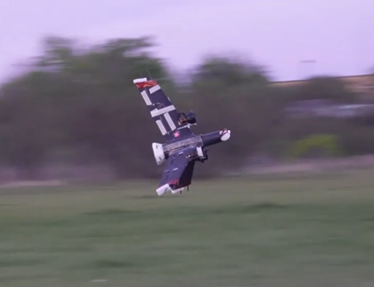

# Tri-Symmetric Hybrid UAV

This repository contains the research and development work for the **Tri-Symmetric Hybrid UAV** project.

  

## Repository

[View the files](https://drive.google.com/drive/folders/1d7UtwUP2wcFa17OPj4aH3DGttraEhLDT?usp=sharing)

## Project

**Tri-Symmetric Hybrid UAV**

A novel hybrid UAV concept combining tri-symmetric geometry with VTOL and forward-flight capabilities.

## Contents

- UAV design and development files
- Supporting files and resources

## Author

**Sandun Vitharana**

Texas A&M University